  

  
  
  
  
  

---

###  关于我

你好，我是**亦青**，也可以叫我 **ghostGJJ**。

一个热爱游戏、健身与代码的小透明。住在B站，每天高强度冲浪。热衷开源社区，喜欢捣鼓各种有意思的项目。

早上睡不醒、下午健身和打游戏、晚上写代码。偶尔买买打折的游戏但是懒得玩。

###  兴趣爱好

 4X 死忠粉 / 肉鸽发烧友　·　 R&B / 周杰伦 / 陶喆 / 方大同　·　 力量训练

 本格推理 / 硬核科幻　·　 GitHub 常驻居民　·　 B站 / 抖音 / 小黑盒

###  技术栈

---

  <i>别睡太晚，梦会变短</i>

