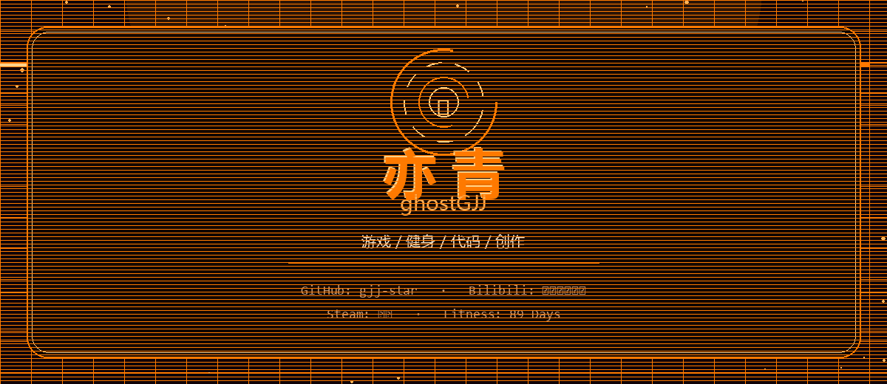

  

  <a href="https://ghostgjj.vercel.app/">个人网站</a> ·
  <a href="https://github.com/gjj-star/gjj-star">项目仓库</a>

  

---

### 👨‍💻 关于我

- 💻 热爱编程与技术探索
- 🚀 持续学习，持续成长
- 🌟 用代码创造价值

### 🛠 技术栈

### 📊 GitHub Stats

  
  

---

  <i>Stay hungry, stay foolish.</i>

